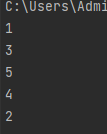
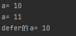

```
var (
   // string 默认值是 空
   name string
   // int 默认值是 0
   age int
)
// 可以同时定义多个
var a, b, c int
```

```
// age := 18 相当于 var age int = 18 自动推到类型
name := "jiangyanlong"
age := 18

println(name, age)
// Pringf 打印变量类型 "%T,%T" 占位符
fmt.Printf("%T,%T", name, age)
```

```
var age int
age = 19

// %d 打印数字类型，%p 打印变量的内存地址 &age 取地址符号
fmt.Printf("num:%d,内存地址:%p", age, &age)
```

```
a := 1
b := 2

//变量值交换
b, a = a, b
```

```
func main() {
   // _ 匿名变量，返回出来的值不想要就可以用_
   a, _ := test()
   print(a)
}

func test() (int, int) {
   return 100, 200
}
```

```
// defer 会被延迟到最后执行，如果程序中有多个defer，当函数执行到最后，defer按逆顺序执行
println(1)
defer println(2)
println(3)
defer println(4)
println(5)
```



```
func main() {
   a := 10
   println("a=", a)
   defer println("defer的a=", a) //参数已经放进去了，只是到最后执行
   a++
   println("a=", a)
}
```



```
func main() {
   // func() 本身就是一个数据类型
   // a()如果加了括号就是函数调用,不加括号就是一个变量
   fmt.Printf("%T", a) //func(int, int) int

   // 定义函数类型的变量
   var b func(int, int) int
   // 把a函数赋值给b函数,函数体指向的是内存地址
   b = a
   // b函数可以执行a函数的操作
   b(1, 2)
   // a,b函数的地址也是一样的
   println(a, b)

}
func a(a, b int) int {
   println(a, b)
   return a + b
}
```

```
func main() {
   //
   a()
   b := a
   b()

   // 匿名函数
   c := func() {
      println("函数b")
   }
   c()

   // 匿名函数后面加上() 自己调用自己
   r := func(a, b int) int {
      println("匿名函数")
      return a + b
   }(1, 2)
   println(r)
   
}
func a() {
   println("函数a")
}
```

```
func main() {
   //chu作为oper的参数
   //oper就叫做高阶函数
   //chu就是回调函数
   println(oper(10, 0, chu))

}
func oper(a, b int, fun func(int, int) int) int {
   return fun(a, b)
}

func jia(a, b int) int {
   return a + b
}

func jian(a, b int) int {
   return a - b
}

func cheng(a, b int) int {
   return a * b
}

func chu(a, b int) int {
   if b == 0 {
      return 0
   }
   return a / b
}
```